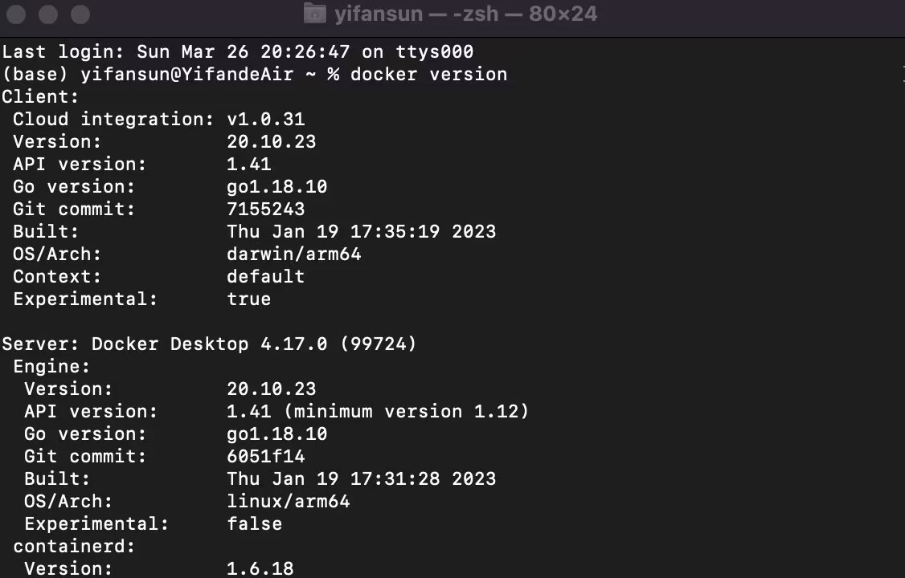

# cs-uy-4613-project
## Milestone-1
I used the MacOS to install the docker and followed the instructions in YouTube. Here are the screenshots of the container page, docker version and the success build of the hello-docker container(example in the Youtube link)

## Milestone-2
My own sentiment analysis app link: https://huggingface.co/spaces/metaknightccc/sentiment-analysis-app

Use the trained model from: https://huggingface.co/cardiffnlp/twitter-roberta-base-sentiment-latest

## Milestone-3
Sentiment analysis app link: https://huggingface.co/spaces/metaknightccc/sentiment-analysis-app

Use bert-base-uncased model from hugging face to train and build a multi-headed model that’s capable of detecting different types of of toxicity.

Dataset from: https://www.kaggle.com/competitions/jigsaw-toxic-comment-classification-challenge

saved folder is the trained model based on the train.csv

finetune.py is used to train the dataset. test.py is used to test hugging face pipeline and the fine-tuned model. From https://www.youtube.com/watch?v=GSt00_-0ncQ&t=470s
